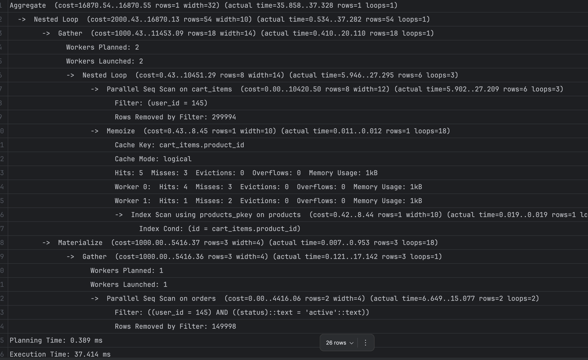
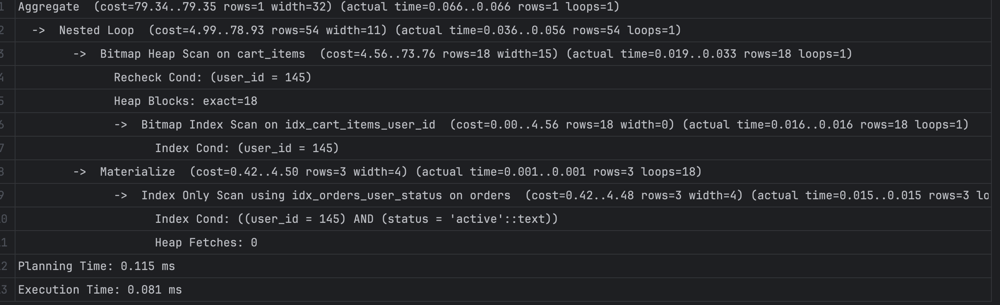

## исходный запрос

EXPLAIN ANALYSE
SELECT SUM(products.price * cart_items.quantity) AS total_cost
FROM products
JOIN cart_items ON products.id = cart_items.product_id
JOIN orders ON orders.user_id = cart_items.user_id
WHERE orders.status = 'active'
AND orders.user_id = 145;

### результат 37.414 ms

## оптимизированный запрос

EXPLAIN ANALYZE
SELECT SUM(cart_items.price * cart_items.quantity) AS total_cost
FROM cart_items
JOIN orders ON orders.user_id = cart_items.user_id
WHERE orders.user_id = 145
AND orders.status = 'active';

### убран избыточчный джоин таблицы products - цена есть в cart_items
### добавим индексы 
CREATE INDEX idx_cart_items_user_id ON cart_items(user_id);
CREATE INDEX idx_cart_items_product_id ON cart_items(product_id);
CREATE INDEX idx_orders_user_status ON orders(user_id, status);

### результат 0.081 ms

